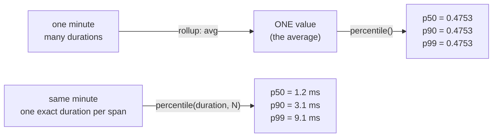

# Percentiles and histogram buckets

Background for [`studio-vs-dynatrace-latency.md`](studio-vs-dynatrace-latency.md). If the
recommendations there look arbitrary, this explains what they are consequences of.

Two independent things corrupt a latency percentile. They look identical in a dashboard and
have different fixes.

| Cause | Symptom | Lives in | Fix |
|---|---|---|---|
| **Rollup collapse** | p50, p90, p99 return *identical* values | the query | read percentiles from spans |
| **Bucket resolution** | percentiles plausible but off by 10–400% | the router config | set explicit `buckets` |

Diagnose before fixing: run the same query at p50, p90 and p99. Identical values mean rollup
collapse, and tuning buckets for that number is wasted effort — it was never a percentile.

## What a percentile requires

Sort 100 requests by duration. The p95 is the 95th. It means 95% finished faster than this.

An average hides the tail: 99 requests at 50 ms and one at 10 s averages to 149 ms, a number
no single request experienced. The p99 is 10 s, which is what the slowest user
actually saw.

Computing a percentile requires **the individual values, in order**. That is exactly what a
histogram throws away.

## What a histogram stores

Counts per range, not durations. Recording every duration is too expensive, so OpenTelemetry
histograms keep tallies: how many requests fell into each predefined range. The ranges are
**buckets** and their edges are **bucket boundaries**.

100 requests under the router's default boundaries:

| Bucket (s) | Count | Cumulative |
|---|---:|---:|
| ≤ 0.005 | 2 | 2 |
| 0.005–0.015 | 5 | 7 |
| 0.015–0.05 | 13 | 20 |
| 0.05–0.1 | 20 | 40 |
| 0.1–0.2 | 25 | 65 |
| 0.2–0.3 | 15 | 80 |
| 0.3–0.4 | 8 | 88 |
| 0.4–0.5 | 5 | **93** |
| **0.5–1.0** | **4** | **97** |
| 1.0–5.0 | 3 | 100 |

## The percentile is interpolated inside a bucket

93 requests finished under 0.5 s, so the 95th is past it. The `0.5–1.0` bucket holds 4,
taking the total to 97. Two of those four are needed — halfway — so the backend assumes an
even spread and reports:

```
0.5 + 0.5 × (1.0 − 0.5) = 0.75 s
```

That last step is an assumption, not a measurement. If all four requests were ~0.52 s, the true p95 is ~0.53 s
and **0.75 s is 42% high**. They could equally have been 0.98 s. The stored data cannot
distinguish the cases.

**Bucket width is the error bar.** Which makes the defaults the problem:

```
0.001, 0.005, 0.015, 0.05, 0.1, 0.2, 0.3, 0.4, 0.5, 1.0, 5.0, 10.0
```

Tight where requests are fast, then `0.5 → 1.0` (500 ms wide) and `1.0 → 5.0`
(**four seconds wide**). Any supergraph fronting real subgraphs has its p95 in that region.

| True p95 | Lands in | Bucket width | Worst-case error |
|---|---|---:|---|
| 180 ms | `0.15–0.2` | 50 ms | a few ms |
| 450 ms | `0.4–0.5` | 100 ms | tens of ms |
| 800 ms | `0.5–1.0` | 500 ms | hundreds of ms |
| 2.1 s | `1.0–5.0` | 4 s | seconds |

Adding boundaries at `0.6, 0.7, 0.8, 0.9` changes nothing about the traffic, but the crossing
bucket becomes 100 ms wide instead of 500 — bringing the same four requests to within ~40 ms
of the truth. That is what [`histogram-buckets.router.yaml`](../templates/histogram-buckets.router.yaml)
sets, and what rule `DT026` flags when it is missing.

GraphOS Studio avoids this entirely: its usage-reporting histogram is log-scale with hundreds
of buckets, each ~10% wider than the last, so its error stays ~10% across the whole range
instead of 500 ms in one place and 4 s in another.

## Why `rollup` returns the average

Separate problem, in the query rather than the router, and worse. `percentile()` on a metric
requires a `rollup:`. Two things happen **in this order**:

1. **Rollup collapses each time slot to one value.** With `rollup: avg`, a minute of traffic
   becomes its average.
2. **The percentile is computed per time slot**, over what remains — one value.

The percentile of a single number is that number, so all three come back equal:



Measured on one hour of identical traffic: three byte-identical series, while the true p90 over
the same window was 713 ms. This is not an approximation of a percentile — it is a different
statistic carrying a percentile's label. Comparing a Studio p90 of 730 ms against a
rollup tile showing 475 ms suggests a 35% ingest discrepancy that does not exist.

Spans carry one exact `duration` per request: no buckets, so no interpolation; no rollup, so no
collapse. That is why every percentile tile in this dashboard reads from spans, and why the two
that cannot — router overhead and payload sizes, which no span carries — report avg/max instead
of a percentile that cannot be computed from the available data.

## The recommendations, as consequences

| Do this | Because |
|---|---|
| Read latency percentiles from spans, not the duration metric | avoids interpolation and rollup collapse at once; a query change, no restart |
| If charting the metric, set explicit `buckets` around your p95/p99 | narrows the error bar where your traffic actually sits |
| Put the top boundary at or above the request timeout | otherwise the last bucket is unbounded and its percentile is meaningless |
| Compare p90 or p99 with Studio, never p95 | Studio's API exposes p50/p90/p99 only, so a p95 tile has no counterpart |
| Set `interval` to the whole window for a comparison number | the average of 60 per-minute p95s is not the hour's p95 |
| Do not attribute disagreements to `temporality: delta` | temporality changes how counts accumulate between exports; it cannot move a percentile, and Studio is not on the OTLP metrics pipeline |

In summary: a histogram discards the individual measurements, so any percentile derived
from one carries an error bar the width of its bucket, and `rollup` discards the
distribution as well, returning an average. Spans retain the individual values.
